footer: rafael cordones | [@rafacm](https://twitter.com/rafacm) | JAMming with GraphCMS, GatsbyJS and GraphQL | [GraphQL Vienna Meetup](https://www.meetup.com/GraphQL-Vienna/)
slidenumbers: true

# JAMming with GraphCMS,
# GatsbyJS and GraphQL
### [GraphQL Vienna February Meetup](https://www.meetup.com/GraphQL-Vienna/events/245911090/)
#### February 5th, 2018

---

# Agenda

1. **Content** management *and presentation/distribution* on the web
1. The Shape of Things to Come... many are already here
1. Why am I here?
  1. We need a "website"
  1. JAMstack, GraphCMS and GatsbyJS
  1. GatsbyJS GraphCMS Plugin  

---

# **WARNING** 
# Meetup in progress...
# We can talk **face to face** about **ideas**!!!

---

# About this talk
# Constructive and **de**constructive criticism welcome!

---

# Credits

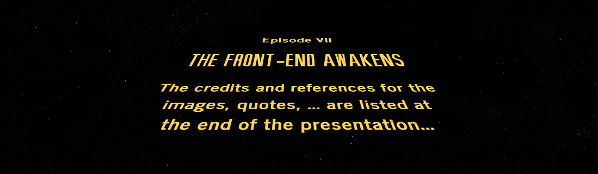

---

# Fasten your seatbelts...

---

# Who are you?

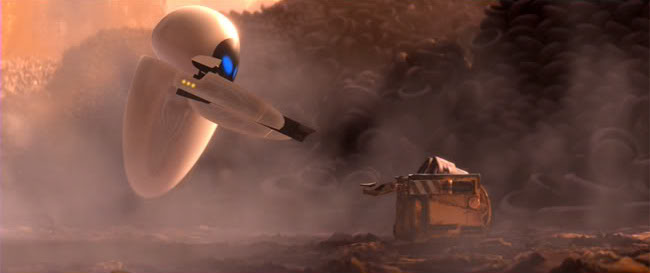

---

# Website Meta Language

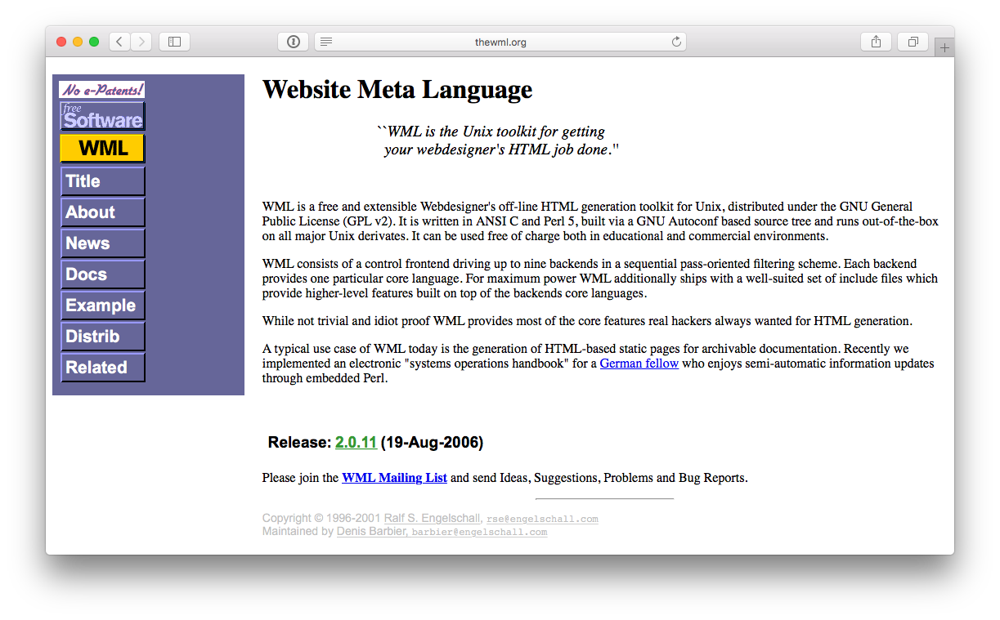

---

# Hosted CMSs

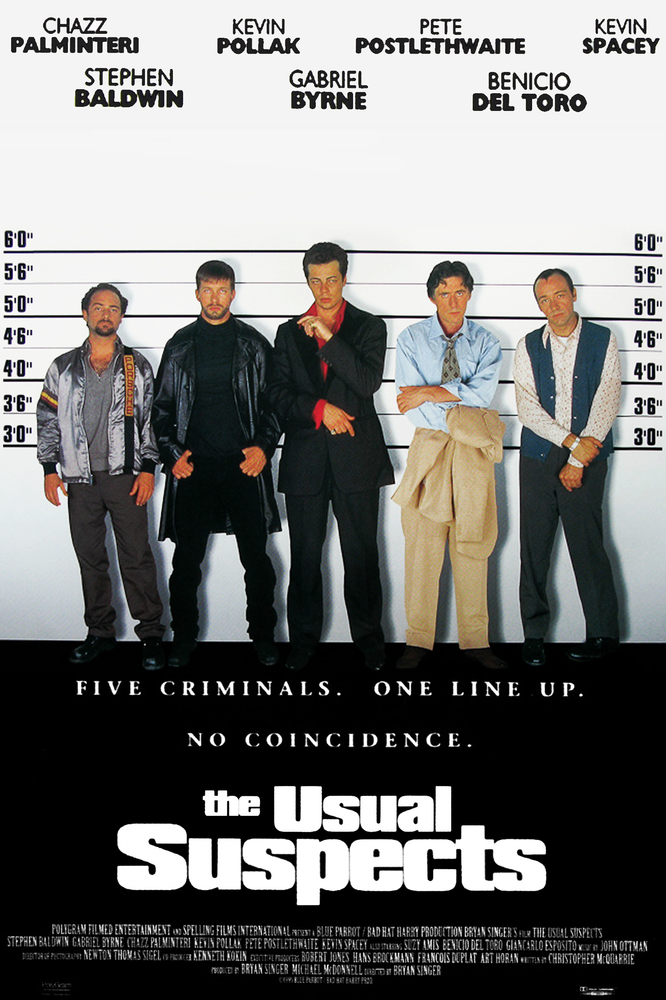

# Spectrum of choices:

1. Blogs, websites, communities, ...
1. Full-stack = back-end + front-end
1. Many offer REST APIs
1. ...
1. They are actually **development platforms**

---

# The Anatomy of a CMS

1. Content modeling, versioning, ...
1. Content editing, versioning, ...
1. Querying / search
1. ACLs: who can do what
1. Audit: who did what when
1. Content rendering (frameworks, libraries, ...)
1. Content analytics, personalization, SEO, ...
1. ...

---

# We need a "website"

> "Software is never finished, just abandoned"
-- Leonardo Dev Vinci

# The website initial **successful website** turns into ...
# ... a **web app**.

---

# The Neutron Dance

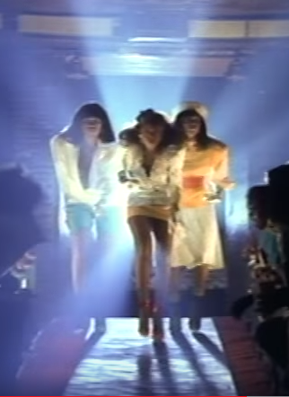

> And it's hard to say
> Just **how some [content] never changes**
> And it's hard to find
> Any **strength to draw the line**
> Oh I'm just burning doin' the neutron dance
> I'm just burning doin' the neutron dance
-- "Neutron Dance" The Pointer Sisters 

---

# The Neutron Dance

1. The half-life of content is considerable higher than that of its presentation.
1. Content **editing** and content **presentation** are different concerns
1. Developers need to learn *each* CMS *APIs* and *framework*
1. Editors need to *learn* the specific CMS administration interface
1. Customers need to find developers for the implementation... every 2 years

---

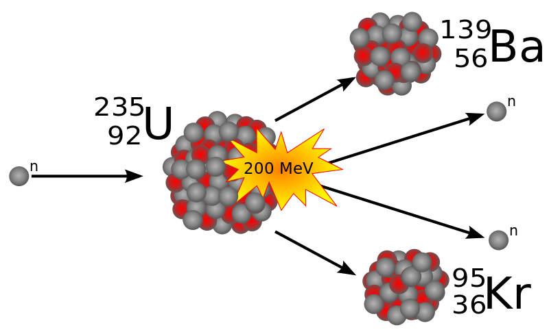

# CMS -> Back-end + Front-end

---

# Back-end?

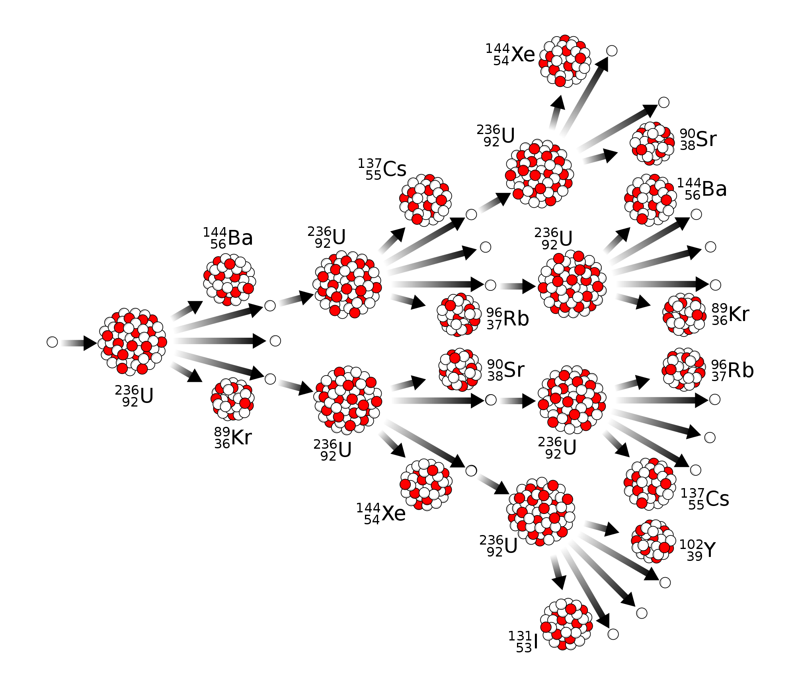

---

# Back-end?

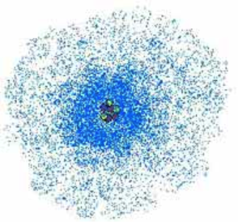

---

# Back-end?

---

# The CMS (Content Management System) is dead!

---
 
# Long Live the CMS (Content Micro-Service)!
# a.k.a. Headless CMS

---

# Headless CMS

--- 

# JAMstack

---

# The Shape of Things to Come

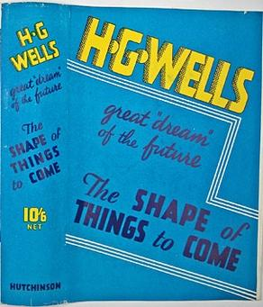

## API-driven CMSs:
1. Contentful
1. prismic.io
1. GENTICS Mesh (Made in Vienna!)
1. GraphCMS
1. ...

---

# O Content, where art thou?

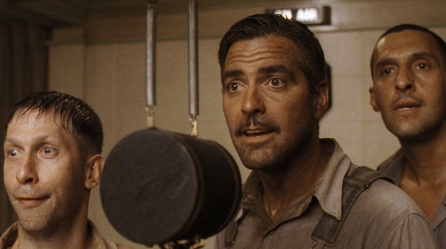

---

# O Content, where art thou?

### "I Am A [Dev] of Constant Sorrow" --- Soggy Bottom [Devs]

1. Proliferation of content repository APIs adds overhead for developers to learn about the **semantics** of the API
1. One API to rule them all?

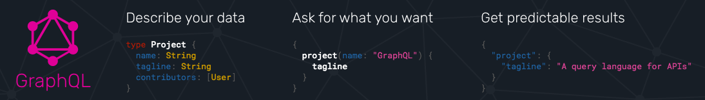

---

# GraphCMS

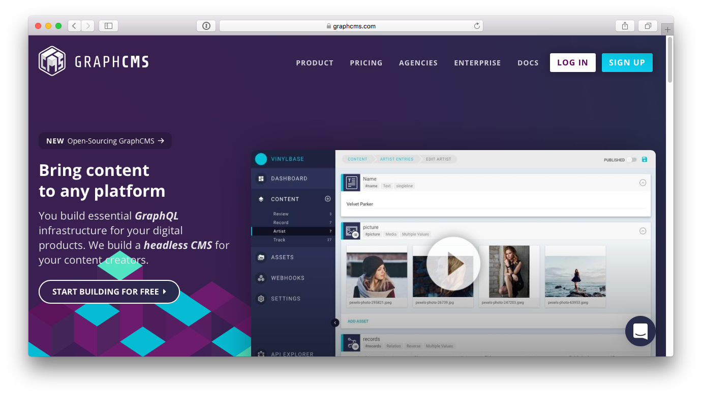

---

# GatsbyJS

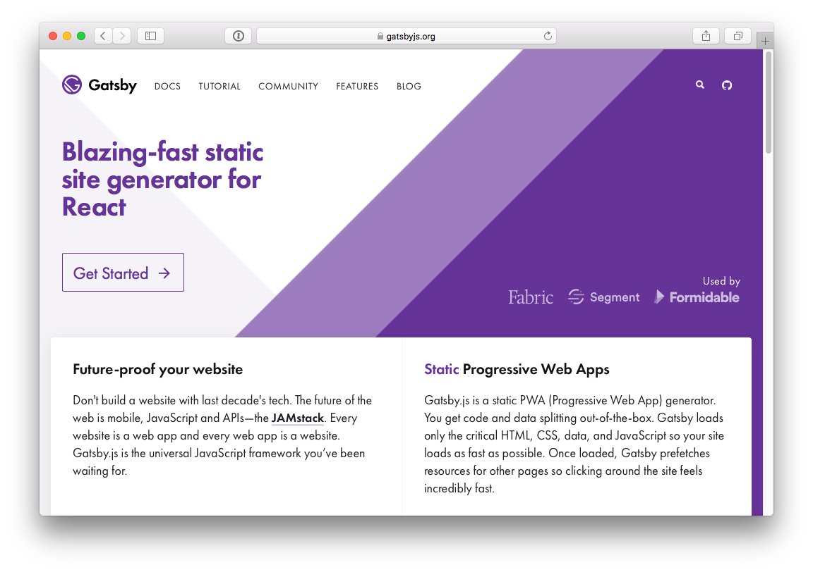

---

> "It’s like déjà vu all over again"
-- Yogi Berra

---

# Why GatsbyJS? JavaScript?! NodeJS?!

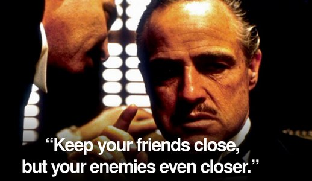

---

# Computers

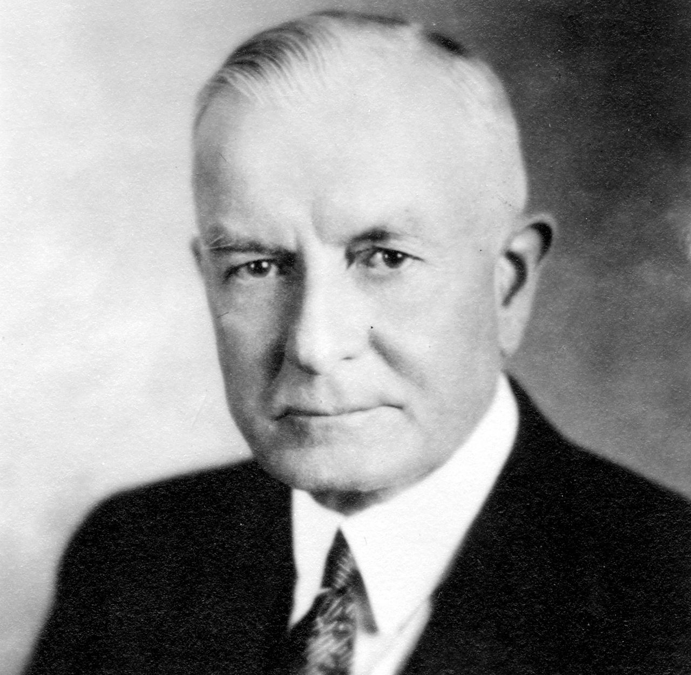

> "I think there is **a world market for maybe five computers**."
-- Thomas J. Watson, president of IBM, **1943**

---

# Computers?

---

# Computers?

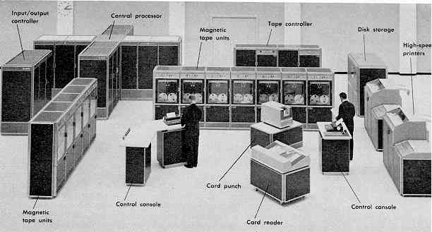

---

# Computers?

---

# Computers?

---

# Computers?

---

# Computers?

---

# 5 Computers!

---

# GatsbyJS GraphCMS Plugin

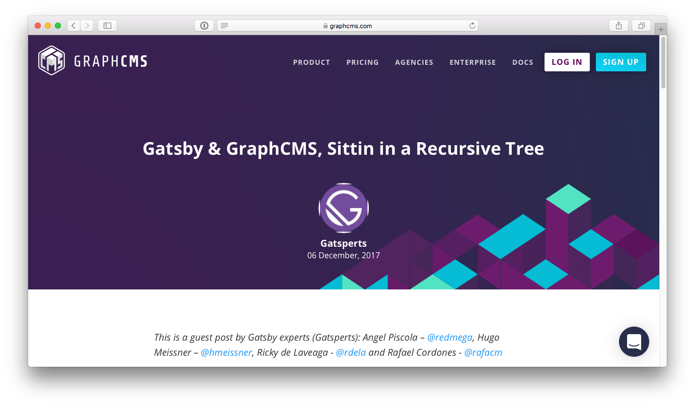

---

# GatsbyJS GraphCMS Plugin

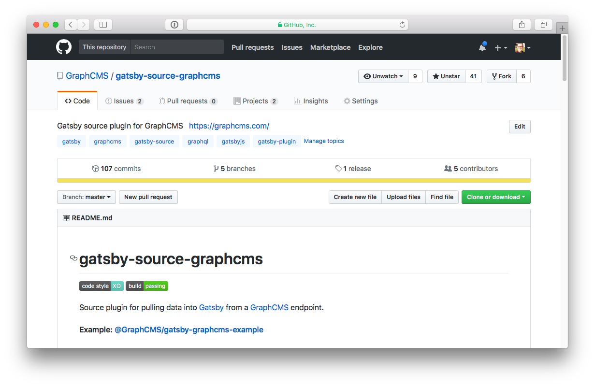

---

# GatsbyJS GraphCMS Plugin

# Tour de code

---

# GatsbyJS GraphCMS Plugin Credits

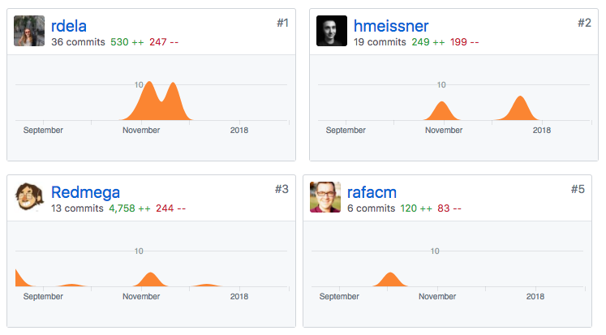

---

---

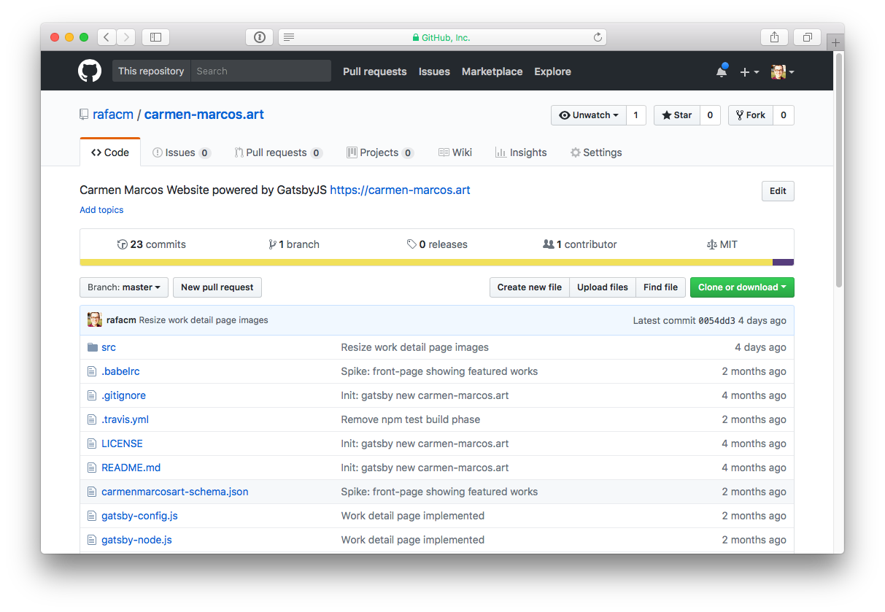

---

# GatsbyJS GraphCMS Plugin

# Lessons learned?

1. O Brother! Where art thou TYPES?!
1. At the end of the day, ship the f* thing
1. Introspecting (metadata) GraphQL query **results** 
1. Content **hierarchy** is fundamental 

---

# A CMS just does CRUD, or?

---

# If all you have is a hammer...

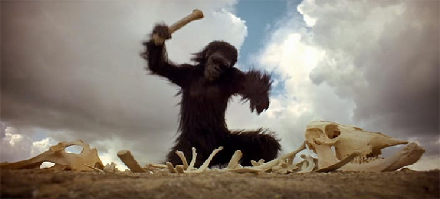

---

# Yeah, well, that's just like, your opinion, man

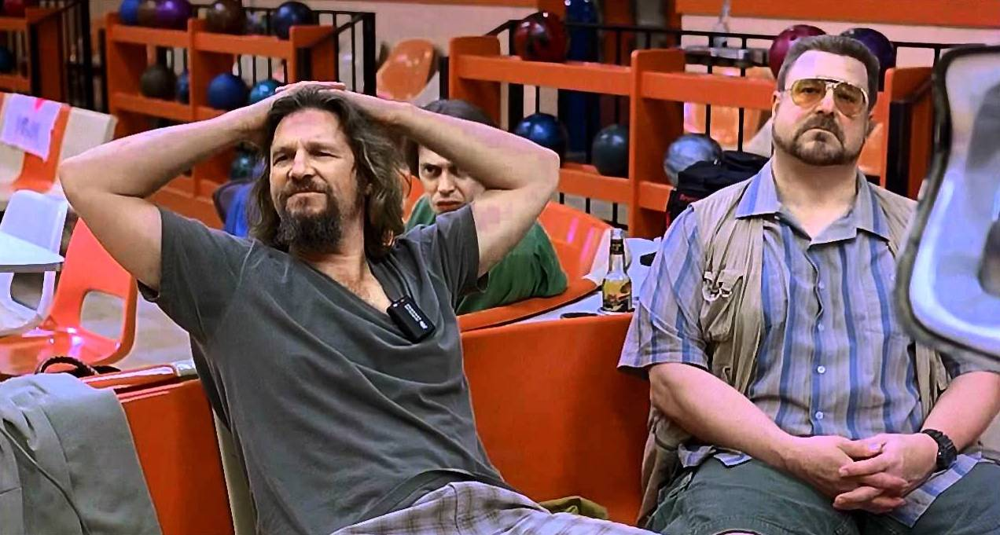

---

# What's yours?!

---

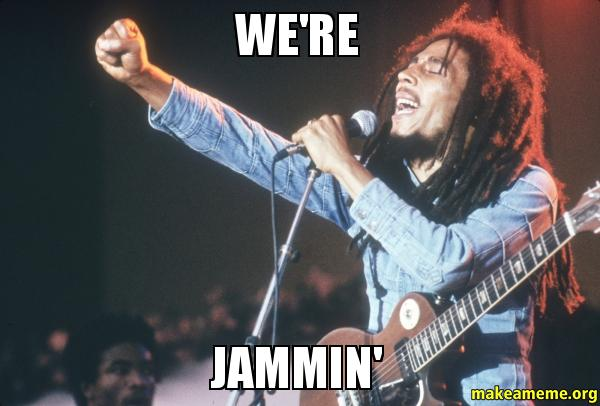

---

# Credits
- Slide 5: [Star Wars Opening Crawl generator](https://brorlandi.github.io/StarWarsIntroCreator)
- Slide 6: [Forklift Safety Signs - Stop Fasten Your Seat Belts With Seat Belt Symbol](http://www.seton.ca/forklift-safety-signs-stop-fasten-your-seat-belts-with-seat-belt-symbol-w1539.html)
- Slide 7: [WALL-E](https://en.wikipedia.org/wiki/WALL-E)
- Slide 8: [Website Meta Language](http://thewml.org/)
- Slide 9: [The Usual Suspects](https://en.wikipedia.org/wiki/The_Usual_Suspects)

---

# Credits

- Slide 10: [The Anatomy Lesson of Dr. Nicolaes Tulp](https://en.wikipedia.org/wiki/The_Anatomy_Lesson_of_Dr._Nicolaes_Tulp)
- Slide 11: [Leonardo Da Vinci](https://en.wikipedia.org/wiki/Leonardo_da_Vinci)
- Slide 12: "The Neutron Dance" ([video](https://www.youtube.com/watch?v=i-jdhorGtQI)) by [The Pointer Sisters](https://en.wikipedia.org/wiki/The_Pointer_Sisters)
- Slide 13: "The Neutron Dance" ([video](https://www.youtube.com/watch?v=i-jdhorGtQI)) by [The Pointer Sisters](https://en.wikipedia.org/wiki/The_Pointer_Sisters)

---

# Credits
- Slide 14: [Kernspaltung](https://de.wikipedia.org/wiki/Kernspaltung)
- Slide 15: [Kernspaltung](https://de.wikipedia.org/wiki/Kernspaltung)

- Slide 1: Man of constant sorrow: https://www.youtube.com/watch?v=meCZ5hWNRFU
- Slide 1: Thomas J. Watson picture: https://en.wikipedia.org/wiki/Thomas_J._Watson#/media/File:Thomas_J_Watson_Sr.jpg
- Slide 1: Alice in Wonderland: https://medium.com/alice-s-adventures-in-wonderland/sir-john-tenniel-s-classic-illustrations-of-alice-in-wonderland-2c3bbdca3a77

---

# Credits
- Slide 1: "The Death of Louis XVI King of France": https://en.wikipedia.org/wiki/Execution_of_Louis_XVI#/media/File:Louis_XVI_-_Execution.jpg
- Slide 1: Neutron Dance: https://www.youtube.com/watch?v=i-jdhorGtQI
- Slide 1: Fission: https://upload.wikimedia.org/wikipedia/commons/thumb/2/2c/Kernspaltung.svg/800px-Kernspaltung.svg.png
- Slide 1: Nuclear fission chain reaction: https://commons.wikimedia.org/wiki/File:Nuclear_fission_chain_reaction.svg

---

# Credits 
- Slide 1: Cloud providers: http://infographic.statista.com/normal/chartoftheday_4546_cloud_infrastructure_market_share_2015_n.jpg
- Slide 1: Computers ENIAC: http://www.phillyvoice.com/70-years-ago-six-philly-women-eniac-digital-computer-programmers/
- Slide 1: Mainframe computer: https://alness.gnomio.com/pluginfile.php/209/mod_resource/content/1/On-line%20Resources/C%20Systems%20Int2/page_25.htm
- Slide 1: Hosted CMSs: https://en.wikipedia.org/wiki/List_of_content_management_systems

