footer: rafael cordones | @rafacm | JAMming with Gentics Mesh, Reat Static and Amazon S3 | We Are Developers Workshops @ APA-IT
slidenumbers: true

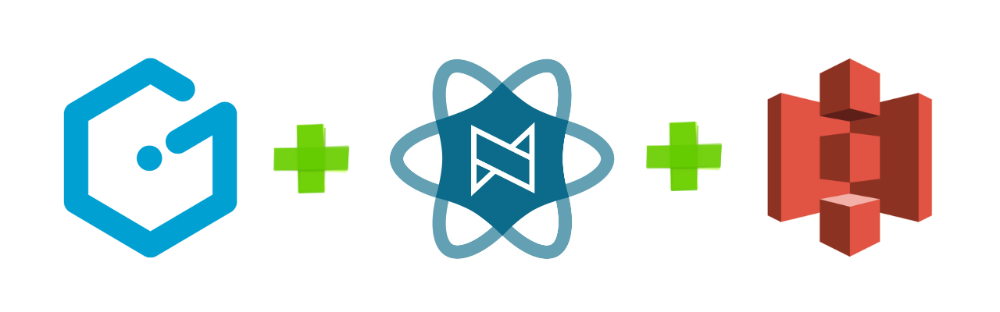

# JAMming with Gentics Mesh, React Static and Amazon S3
#### We Are Developers /  Workshops @ APA-IT / Vienna, May 16th, 2018

---

# Agenda

1. Teaser talk
1. Gentics Mesh: tour _de_ features 
1. Break (10 min.)
1. React Static & React 
1. Features implementation
1. Amazon S3 
1. Wrap-up

---

# Teaser talk

---

# Credits
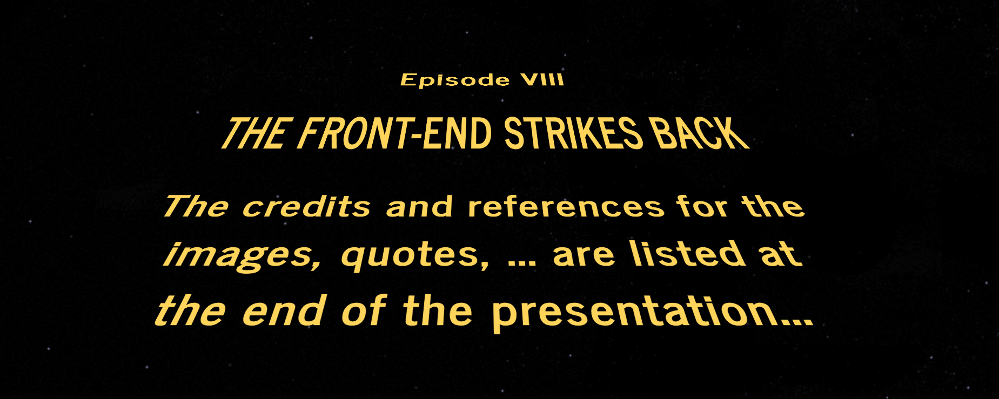

---

# Web Content Projects
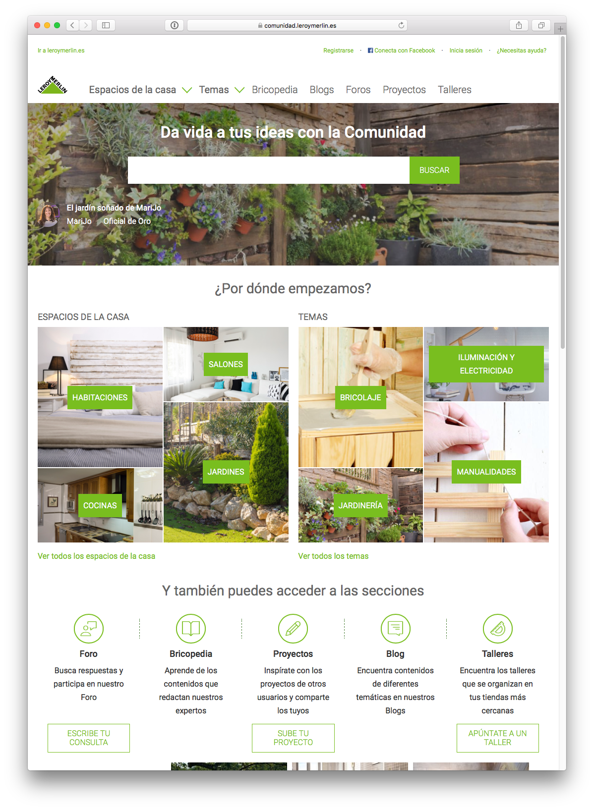

1. (Internal) content publication
2. (External) user generated content
3. 6-12 months projects
2. 10x of page types
2. 100x of components
2. 1,000x of content items
2. 100,000x of users

Implemented on a **monolithic CMS**.

---

# The content stays the same 

Web **front-end design** 
 
**changes** every 2 years but 
 
the **content remains the same**

---

# Thinking (and implementing!) in **components**
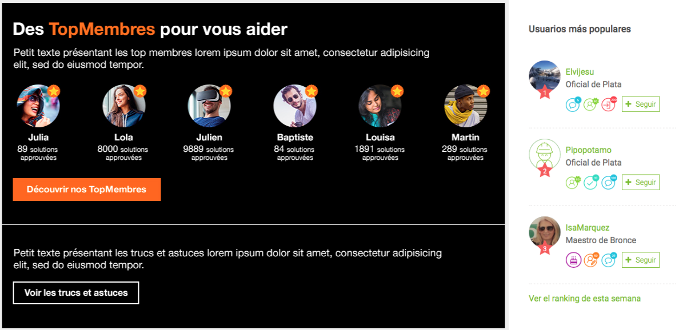

---

# SEO, SEO, SEO
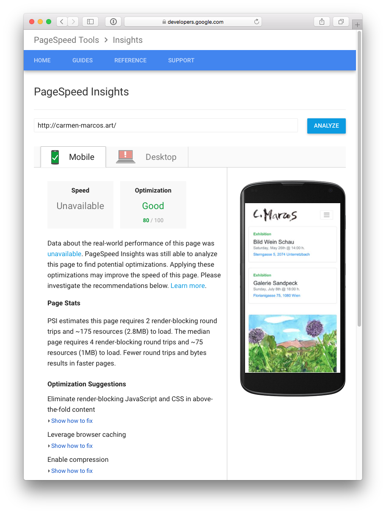

1. Page speed: Time to first byte (TTFB)
2. Light-weight markup
2. Pre-rendered markup vs render markup per request
3. Nice & structured URLs
4. Breadcrumbs with metadata
5. ...

---

# The Anatomy of a CMS

1. Content modeling (and migrations)
1. Content creation/editing
1. Querying / search
1. Permissions: who can do what
1. **Content rendering (frameworks, libraries, ...)**
1. ...

---

# Content rendering (frameworks, libraries, ...)

What if...

1. CMS back-end & front-end were completely separated?
1. Content could be managed independently of the front-end?
1. Content could be accessed just via APIs
1. Front-end could be developed with any tech or framework?

... the **CMS would just focus on content**

---

# The CMS* is dead!
## * Content **Management System**

---
 
# The CMS* is dead!
## * Content **Management System**
# Long Live the CMS*
## * Content **Micro-Service**

## a.k.a. Headless CMS
## a.k.a. API-driven CMS

---

# The content stays the same
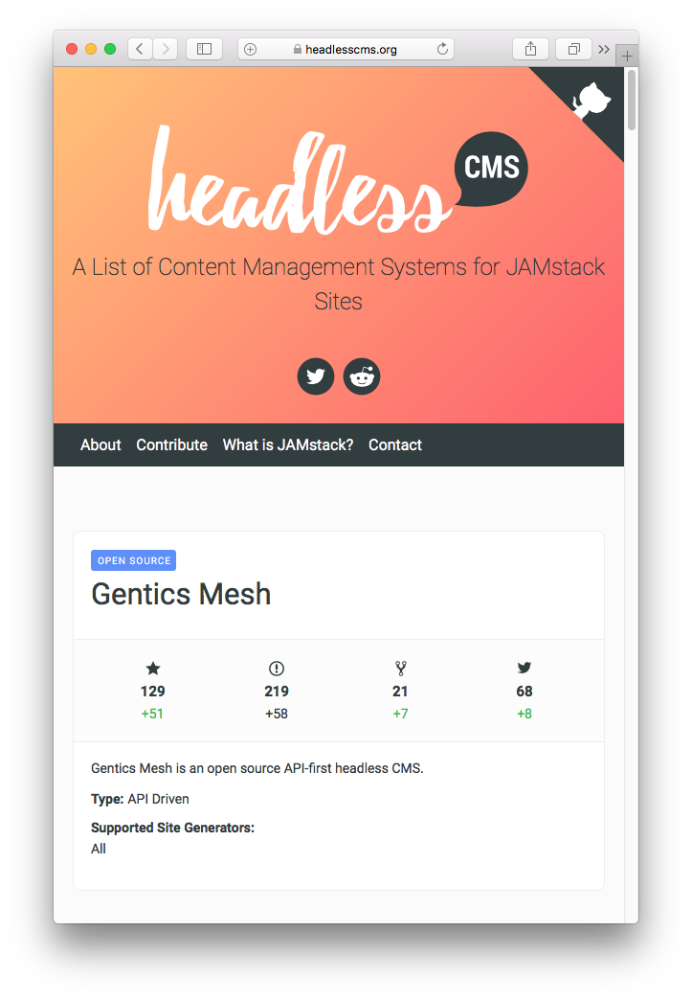

Headless / API-first CMSs

1. [contentful](https://www.contentful.com/) (Saas)
1. [prismic](https://prismic.io) (Saas)
1. [GraphCMS](https://graphcms.com/) (Saas)
1. [Contenta CMS](https://www.contentacms.org/) (Open-Source)
1. ...
1. [Gentics Mesh](https://getmesh.io) (Open-Source)

... all with different **content APIs**!

---

# Content APIs: O Content, where art thou?

> "I Am A [Dev] of Constant Sorrow" 
-- Soggy Bottom [Devs]

---

# Content APIs: O Content, where art thou?
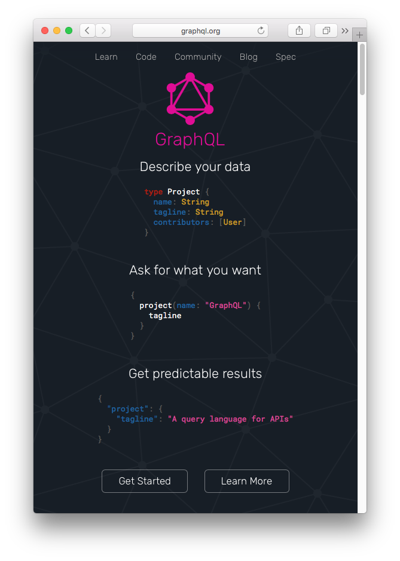

1. Proliferation of content repository APIs adds overhead for developers to learn about the **semantics** of the API
1. One query API language to rule them all?
1. **GraphQL support is a MUST HAVE.**

---

# Gentics Mesh

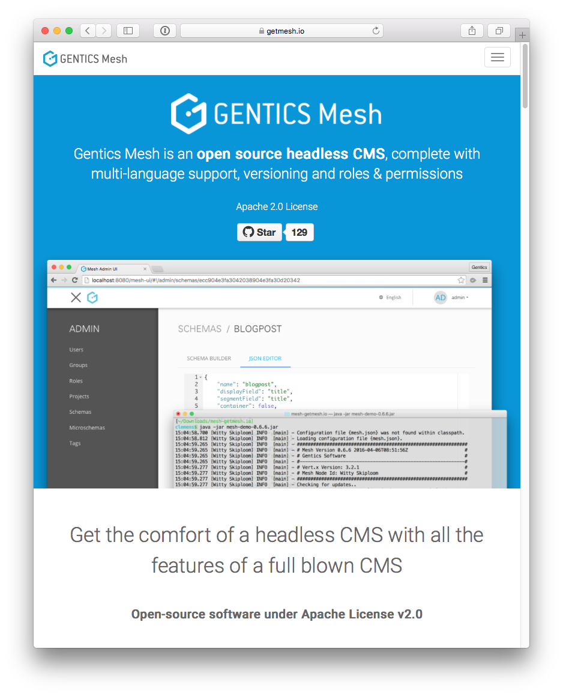

1. (Hierarchical) **content tree**: scalability! 
1. APIs: REST, **GraphQL**, ElasticSearch 
1. **Image manipulation**: via API & via management UI
3. **Multi-lingual** support
4. On-(cloud)-premise: **own your content**! 
5. Users, groups, roles & permissions
6. ...

---

# React: it's components all the way down!
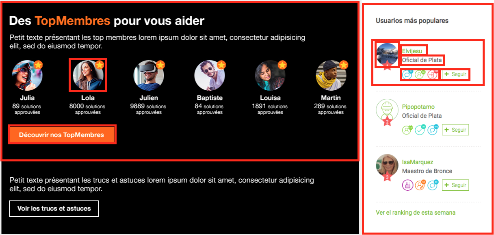

---

# React Static: my gateway drug to React
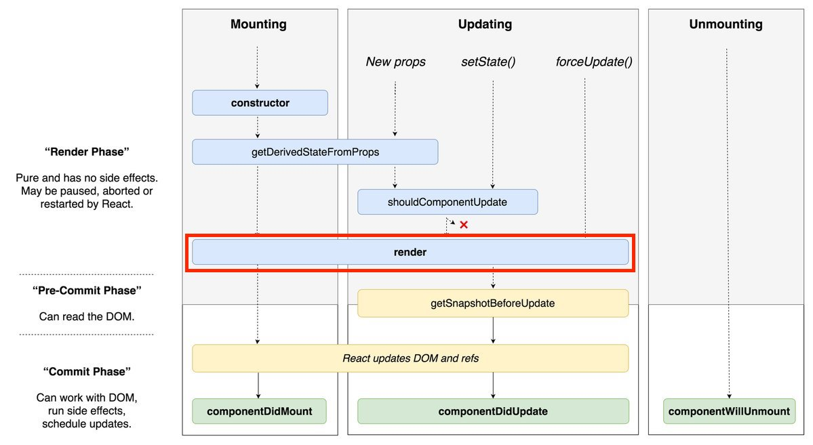

---

# SEO, SEO, SEO

JAMstack

1. **J**avaScript: the language of the web
2. **A**PIs: to access content
3. **M**arkup: pre-rendered HTML markup

Amazon S3 for content delivery

1. Managed, scalable and cheap
 
/ **The web browser is the new web server!** /

---

# Main takeways (1/2)
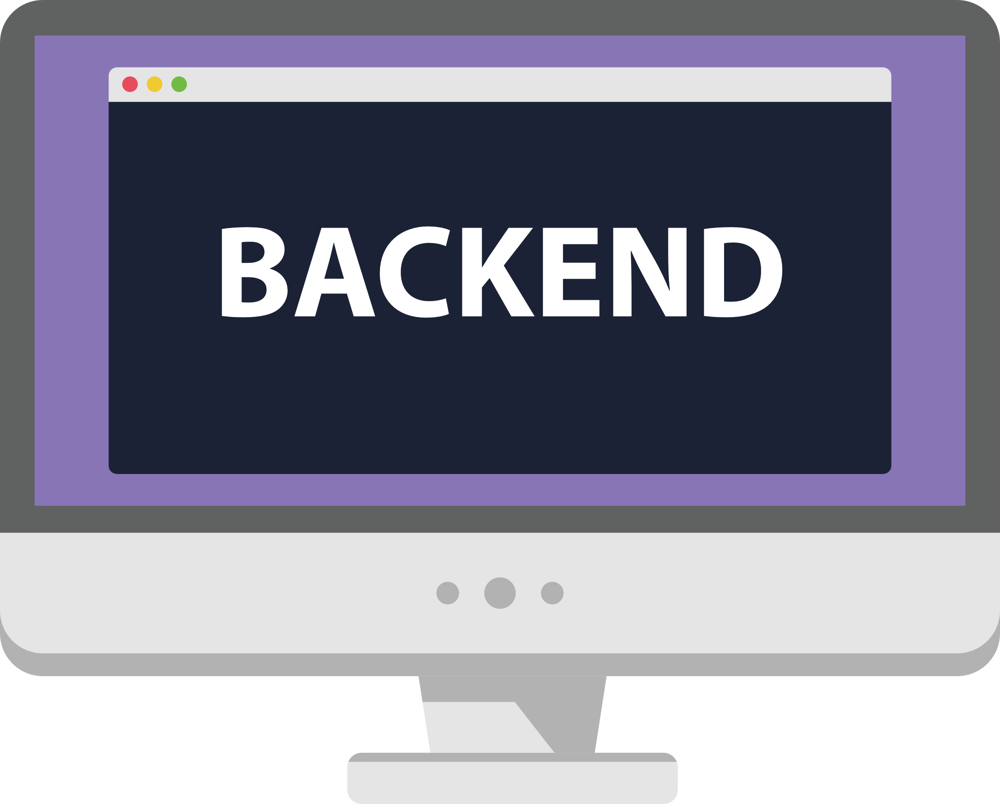

As a back-end developer:

1. Do you build your own search engine, business process engine, ...? 
No you don't.
1. Do you build your own content management infrastructure? 
You should not.

---

# Main takeways (2/2)
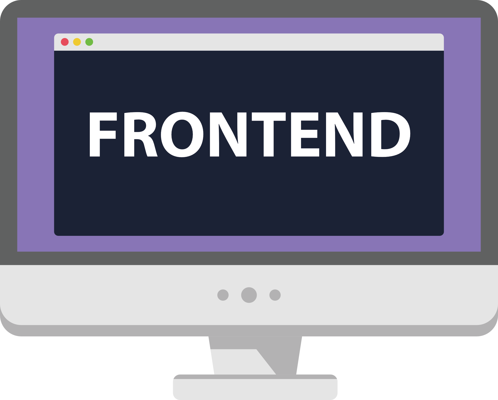

As a front-end developer

1. Abstract away the management aspect of content
1. Focus on the front-end implementation with freedom of choice

---

# The Project
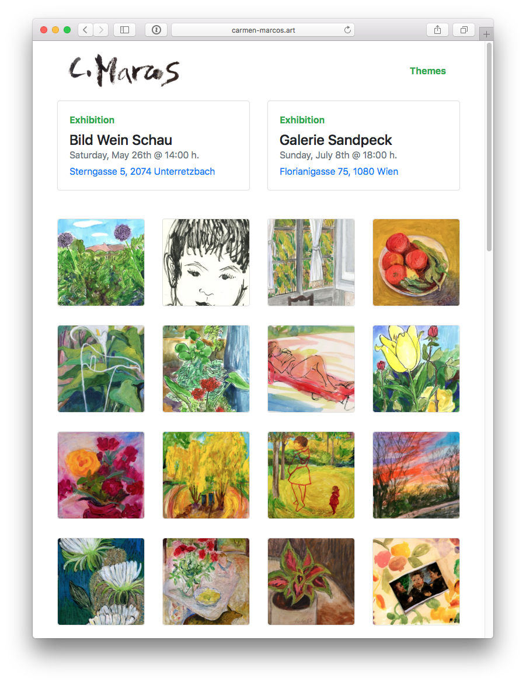

1. ...
2. prismic.io + (Scala) Play! Framework
1. ...
2. Contentful + (JavaScript) Angular 1.x
1. ...
2. GraphCMS + (JavaScript) GatsbyJS
1. **Gentics Mesh + (JavaScript) React Static**

---

# Any questions?!

---

# Gentics Mesh: Tour de Features
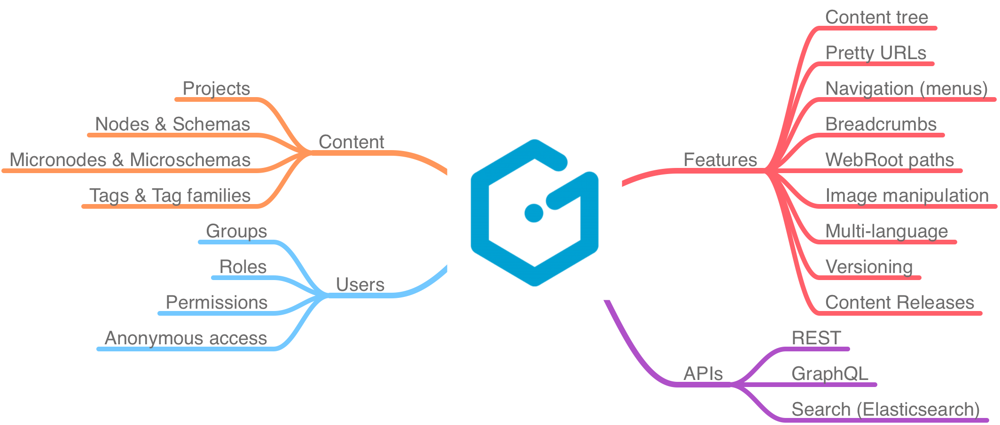

---

# React Static & React

---

# Amazon S3 for website hosting
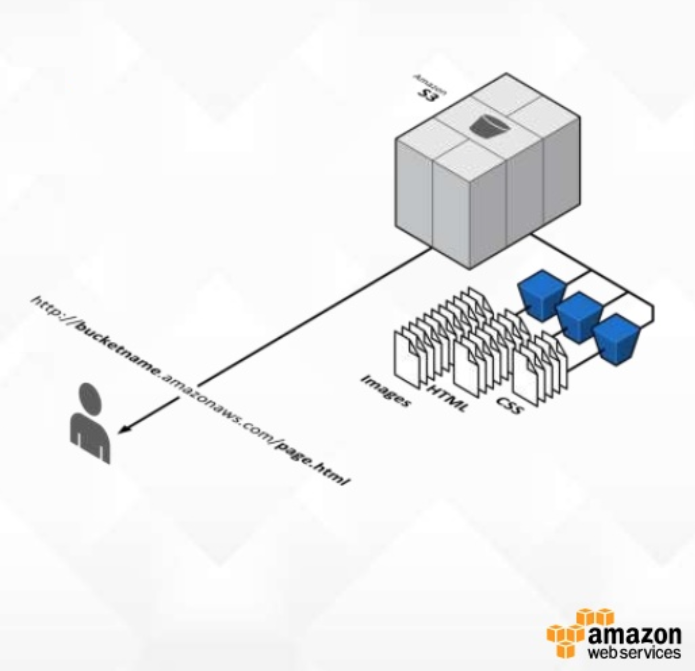

1. S3 is the static web server
1. S3 is fully managed and scales
1. (Optionally) add CDN capabilities with CloudFront
 
--- 