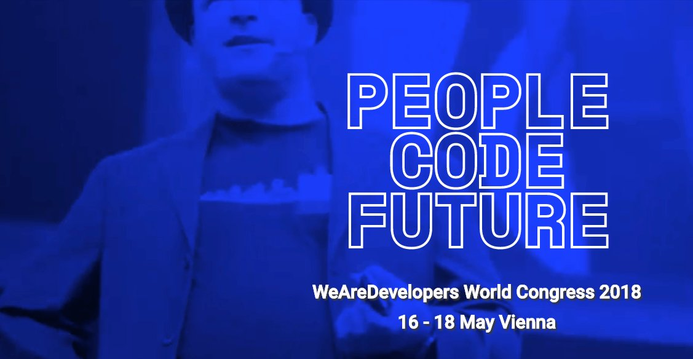

footer: rafael cordones | @rafacm | JAMming with Gentics Mesh, Reat Static and Amazon S3 | We Are Developers Workshops @ APA-IT
slidenumbers: true

# JAMming with Gentics Mesh, Reat Static and Amazon S3
#### We Are Developers /  Workshops @ APA-IT / Vienna, May 16th, 2018

---

# Workshop Agenda 1/2

1. Talk: how did we get here? ~10 min.
1. Gentics Mesh: Tour de Force ~15 min.
1. React & React Static (Reader's Digest Version) ~10 min.
1. Amazon S3 ~5 min.
1. React Static Gentics Mesh Example ~10 min.
1. Let's play! 

---

# Intro talk

---

# Credits

---

# Who are you?

---

# Topics
1. Monolithic CMSs up to now where CMS = Content Management System
1. Use-cases for API-first / headless CMSs where CMS = Content Micro-Service 
1. Mesh unique features and how they compare to others (GraphCMS, Contentful, ...)
1. Use-cases for "statically" generated websites
1. Progressive Static-Site generators: React Static vs GatsbyJs

--- 

# WeAreDevelopers

---

# Past

---

# Hosted CMSs

# Spectrum of choices:

1. Blogs, websites, communities, ...
1. Full-stack = back-end + front-end
1. Many offer REST APIs
1. ...
1. They are actually **development platforms**

---

# The Anatomy of a CMS

1. Content modeling, versioning, ...
1. Content editing, versioning, ...
1. Querying / search
1. ACLs: who can do what
1. Audit: who did what when
1. Content rendering (frameworks, libraries, ...)
1. Content analytics, personalization, SEO, ...
1. ...

---

# We need a "website"

> "Software is never finished, just abandoned"
-- Leonardo Dev Vinci

# The website initial **successful website** turns into ...
# ... a **web app**.

---

# The Neutron Dance

> And it's hard to say
> Just **how some [content] never changes**
> And it's hard to find
> Any **strength to draw the line**
> Oh I'm just burning doin' the neutron dance
> I'm just burning doin' the neutron dance
-- "Neutron Dance" The Pointer Sisters 

---

# The Neutron Dance

1. The half-life of content is considerable higher than that of its presentation.
1. Content **editing** and content **presentation** are different concerns
1. Developers need to learn *each* CMS *APIs* and *framework*
1. Editors need to *learn* the specific CMS administration interface
1. Customers need to find developers for the implementation... every 2 years

---

# CMS -> Back-end + Front-end

---

# Back-end?

---

# Back-end?

---

# Back-end?

---

# The CMS (Content Management System) is dead!

---
 
# Long Live the CMS (Content Micro-Service)!
# a.k.a. Headless CMS

---

# Headless CMS

--- 

# JAMstack

---

# The Shape of Things to Come

## API-driven CMSs:
1. [contentful](https://www.contentful.com/)
1. [prismic](https://prismic.io)
1. [GraphCMS](https://graphcms.com/)
1. [GENTICS Mesh](https://getmesh.io) (Made in Vienna!)
1. ...

---

# O Content, where art thou?

---

# O Content, where art thou?

### "I Am A [Dev] of Constant Sorrow" --- Soggy Bottom [Devs]

1. Proliferation of content repository APIs adds overhead for developers to learn about the **semantics** of the API
1. One API to rule them all?

---

# GraphCMS

---

# GatsbyJS

---

> "It’s like déjà vu all over again"
-- Yogi Berra

---

# My background?

### Back-end Java/Scala development (type and function signatures)
### Server-side "front-end" generated with dashes of JavaScript

---

# Why GatsbyJS? JavaScript?! NodeJS?!

---

# Why headless CMS?

---

# Computers

> "I think there is **a world market for maybe five computers**."
-- Thomas J. Watson, president of IBM, **1943**

---

# Computers?

---

# Computers?

---

# Computers?

---

# Computers?

---

# Computers?

---

# Computers?

---

# 5 Computers!

---

# GatsbyJS GraphCMS Plugin

---

# GatsbyJS GraphCMS Plugin

---

# GatsbyJS GraphCMS Plugin

# Tour de code

---

# GatsbyJS GraphCMS Plugin Credits

---

---

---

# GatsbyJS GraphCMS Plugin

# Lessons learned?

1. GatsbyJS codebase: O Brother! Where art thou TYPES?!
1. NPM: at the end of the day, relase/ship the f* thing
1. GraphQL: introspecting (metadata/types) GraphQL query **results** 
1. GraphCMS: content **hierarchy** a must have when scaling 

---

# A CMS just does CRUD, or?

---

# If all you have is a hammer...

---

# Yeah, well, that's just like, your opinion, man

---

# What's yours?!

---

---

---

# Gentics Mesh: Tour de Force

---

# React & React Static (Reader's Digest Version)
1. Components: a function by another name

---

## Reader's Digest Version

#
---

# Talk Main Points
