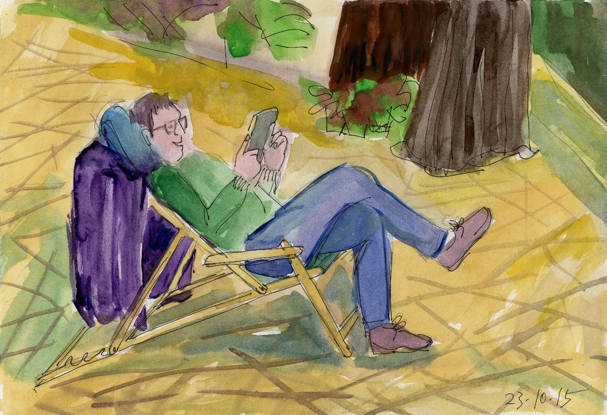
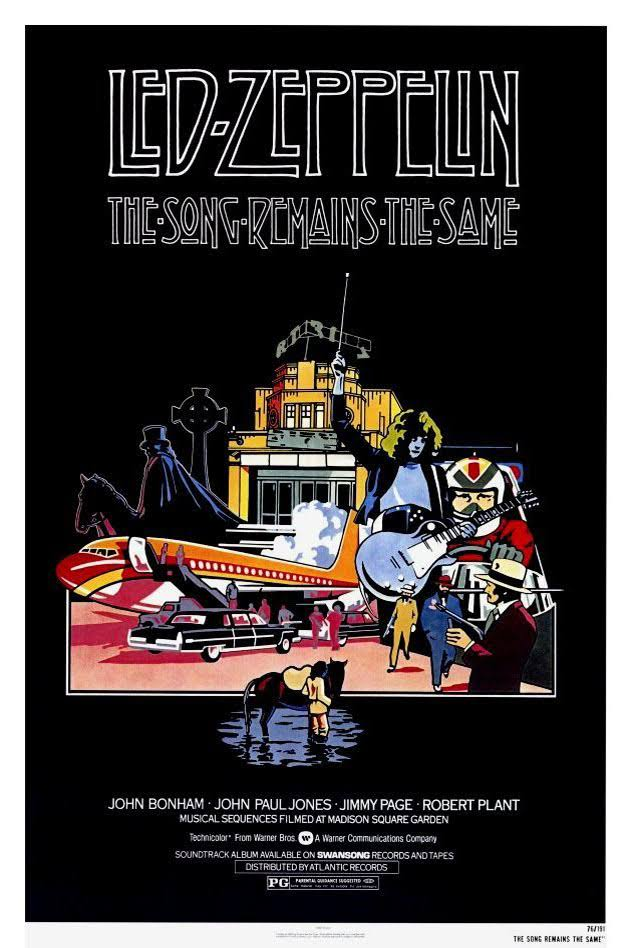
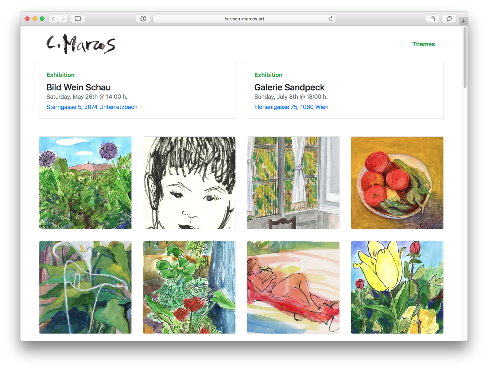
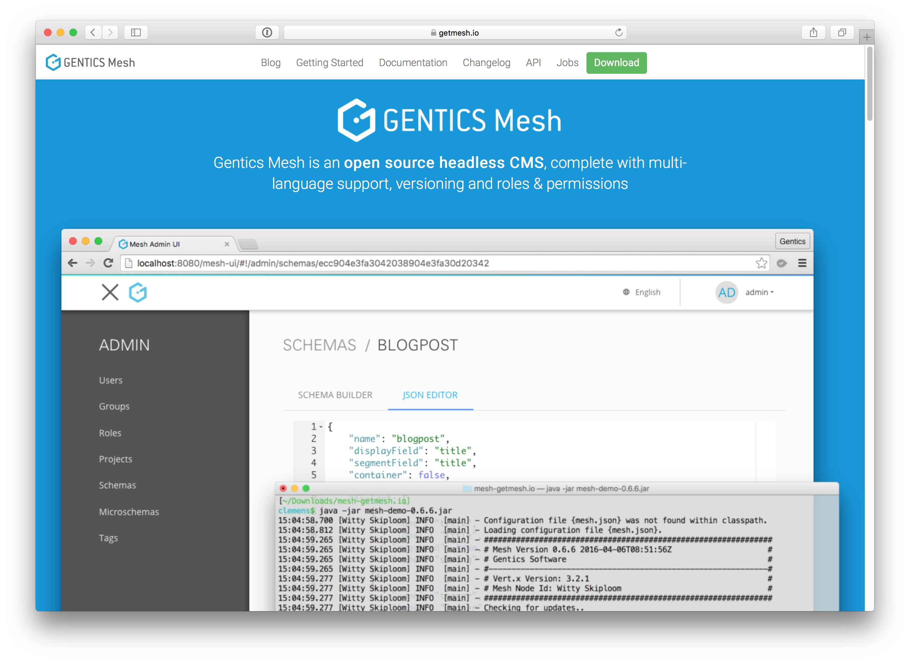

footer: rafael cordones | @rafacm | JAMming with Gentics Mesh, Reat Static and Amazon S3 | We Are Developers Workshops @ APA-IT
slidenumbers: true

# JAMming with Gentics Mesh, React Static and Amazon S3
#### We Are Developers /  Workshops @ APA-IT / Vienna, May 16th, 2018

---

# Agenda

1. Teaser talk: how did I get here? (15 min.)
1. Gentics Mesh: Tour de Force (30 min.)
1. Break (10 min.)
1. React Static & React (10 min.)
1. Feature implementation (30 min.) 
1. Amazon S3 (10 min.)
1. Wrap-up (5 min.) 

---

# Talk

---

# Fasten your seatbelts...

---

# Credits

---

# Who am I?

---

# Background

---

# Web Content Projects

1. Internal content publication
2. External user generated content
3. 6-12 months projects
2. 10x of page types
2. 100x of components
2. 1000x of content items
2. 100000x of users

---

## Patterns

## ...
## Web front-end design 
## ...
## changes every 2 years but 
## ...
## the content remains the same

---

# Patterns: thinking in components

---

# Patterns: the anatomy of a component

1. Retrieve and aggregate data 
1. Render the data + HTML markup + styling 
1. React to user input

---

# Patterns: "we need a website"

> "Software is never finished, just abandoned"
-- Leonardo Dev Vinci

# The initial **successful website** turns...
# into a **web application**.

# CMSs are **development platforms**

---

# Monolithic/full-stack CMS, we need to talk: what if...

1. CMS back-end & front-end were completely separated?
1. Front-end could be developed with any tech or framework?
1. Content could be managed independently of the front-end?

---

# The CMS* is dead!
## * Content **Management System**

---
 
# Long Live the CMS*
## * Content **Micro-Service**
### a.k.a. API-driven CMS
### a.k.a. Headless CMS

---

# Headless CMS

---

# Headless CMS

> "Making a major horizontal product that's
> useful in any walk of life is almost 
> impossible to pull off." 
-- Joel Spolsky*

*He is here at WeAreDevelopers! 
Tomorrow Friday @ 09:30 h. on Stage F1!

---

# Why headless CMS?

---

# The Anatomy of a CMS

1. Content modeling
1. Content editing
1. Querying / search
1. Permissions: who can do what
1. Audit: who did what when
1. Content rendering (frameworks, libraries, ...)
1. Content analytics, personalization, SEO, ...
1. ...

---

# Headless / API-first CMSs

1. [contentful](https://www.contentful.com/) (Saas)
1. [prismic](https://prismic.io) (Saas)
1. [GraphCMS](https://graphcms.com/) (Saas)
1. [Contenta CMS](https://www.contentacms.org/) (Drupal)
1. ...

---

# Content APIs: O Content, where art thou?

---

# Content APIs: O Content, where art thou?

### "I Am A [Dev] of Constant Sorrow" --- Soggy Bottom [Devs]

1. Proliferation of content repository APIs adds overhead for developers to learn about the **semantics** of the API
1. One API to rule them all?

---

# How did I get here?

---

# How did I get here?

1. ...
2. prismic.io + (Scala) Play! Framework
1. ...
2. Contentful + (JavaScript) Angular 1.x
1. ...
2. GraphCMS + (JavaScript) GatsbyJS
1. **Gentics Mesh + (JavaScript) React Static**

---

# Gentics Mesh

---

# Gentics Mesh

1. (Hierarchical) content tree: scalability! 
1. Users, groups, roles & permissions
1. APIs: REST, GraphQL, ElasticSearch 
1. Image manipulation: via API & via management UI
1. Multi-linguality
1. On-(cloud)-premise: own my data! 

---

# JAMstack

---

# Yeah, well, that's just like, your opinion, man

---

# What's yours?!

---

---

# Topics
1. Monolithic CMSs up to now where CMS = Content Management System
1. Use-cases for API-first / headless CMSs where CMS = Content Micro-Service 
1. Mesh unique features and how they compare to others (GraphCMS, Contentful, ...)
1. Use-cases for "statically" generated websites
1. Progressive Static-Site generators: React Static vs GatsbyJs

----

# WeAreDevelopers

---

# Gentics Mesh

## If you want to ***own your content infrastructure*** 

---

# How does it compare?

---

# Gentics Mesh

---

# Gentics Mesh

---

# GatsbyJS

---

> "It’s like déjà vu all over again"
-- Yogi Berra

---

# My background?

### Back-end Java/Scala development (type and function signatures)
### Server-side "front-end" generated with dashes of JavaScript

---

# Why GatsbyJS? JavaScript?! NodeJS?!

---

# GatsbyJS GraphCMS Plugin

---

# GatsbyJS GraphCMS Plugin

---

# GatsbyJS GraphCMS Plugin

# Tour de code

---

# GatsbyJS GraphCMS Plugin Credits

---

---

---

# GatsbyJS GraphCMS Plugin

# Lessons learned?

1. GatsbyJS codebase: O Brother! Where art thou TYPES?!
1. NPM: at the end of the day, relase/ship the f* thing
1. GraphQL: introspecting (metadata/types) GraphQL query **results** 
1. GraphCMS: content **hierarchy** a must have when scaling 

---
# Computers

> "I think there is **a world market for maybe five computers**."
-- Thomas J. Watson, president of IBM, **1943**

---

# Computers?

---

# Computers?

---

# Computers?

---

# Computers?

---

# Computers?

---

# Computers?

---

# 5 Computers!

---

# A CMS just does CRUD, or?

---

# If all you have is a hammer...

---

---

# Gentics Mesh: Tour de Force

---

# React Static & React

---

# Talk Main Points
