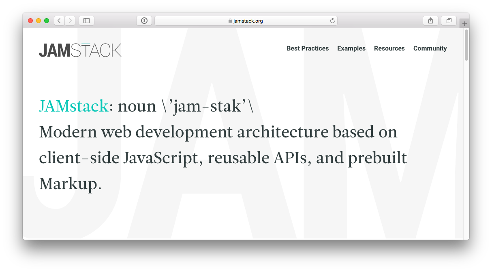

footer: rafael cordones | [@rafacm](https://twitter.com/rafacm) | JAMming with Gentics Mesh, Reat Static and Amazon S3 | [We Are Developers Workshops @ APA-IT](https://www.wearedevelopers.com/)
slidenumbers: true

# JAMming with Gentics Mesh, Reat Static and Amazon S3
### [We Are Developers Workshops @ APA-IT](https://www.wearedevelopers.com/)
#### Vienna, May 16th, 2018

---

# Agenda
1. Talk (30 min)
1. Live coding (30 min)
1. Break (15 min.)
1. Your turn! (45 min.)

---

# Topics
1. Patterns in the sky
1. The History of CMS... content... separation of container and information...
1. Headless vs decoupled vs API-First

---

# What will you learn?
1. What is content? --> Dean Barker book
1.  

---

> The trouble with our times is that the future is not what it used to be. 
> -- Paul Valéry

Reference: https://quoteinvestigator.com/2012/12/06/future-not-used/ 

--- 

1. **Content** management *and presentation/distribution* on the web
1. The Shape of Things to Come... many are already here
1. Why am I here?
  1. We need a "website"
  1. JAMstack, GraphCMS and GatsbyJS
  1. GatsbyJS GraphCMS Plugin  

---

# The Anatomy of a Web Page

1. Menu
2. Breadcrumb
3. ... 

---

# Implementation **Patterns**
1. Is the user logged in?
2. Breadcrumb (location / context)
3. Paginating results 
4. Responsive images

---

# Content Trees?

--- 

# Breadcrumb

1. 

--- 

# **WARNING** 
# Workshop in progress...
# We can talk **face to face** about **ideas**... and even try them!!!

---

# About this talk
# Constructive and **de**constructive criticism welcome!

---

# Credits

---

# Fasten your seatbelts...

---

# Who are you?

---

# Website Meta Language

---

# Hosted CMSs

# Spectrum of choices:

1. Blogs, websites, communities, ...
1. Full-stack = back-end + front-end
1. Many offer REST APIs
1. ...
1. They are actually **development platforms**

---

# The Anatomy of a CMS

1. Content modeling, versioning, ...
1. Content editing, versioning, ...
1. Querying / search
1. ACLs: who can do what
1. Audit: who did what when
1. Content rendering (frameworks, libraries, ...)
1. Content analytics, personalization, SEO, ...
1. ...

---

# We need a "website"

> "Software is never finished, just abandoned"
-- Leonardo Dev Vinci

# The website initial **successful website** turns into ...
# ... a **web app**.

---

# The Neutron Dance

> And it's hard to say
> Just **how some [content] never changes**
> And it's hard to find
> Any **strength to draw the line**
> Oh I'm just burning doin' the neutron dance
> I'm just burning doin' the neutron dance
-- "Neutron Dance" The Pointer Sisters 

---

# The Neutron Dance

1. The half-life of content is considerable higher than that of its presentation.
1. Content **editing** and content **presentation** are different concerns
1. Developers need to learn *each* CMS *APIs* and *framework*
1. Editors need to *learn* the specific CMS administration interface
1. Customers need to find developers for the implementation... every 2 years

---

# CMS -> Back-end + Front-end

---

# Back-end?

---

# Back-end?

---

# Back-end?

---

# The CMS* is dead!

*Content Management System

--- 

# Long Live the CMS*!

a.k.a. Headless CMS
a.k.a. API-First CMS
a.k.a. *Content Micro-Service?

---

# Headless CMS

--- 

# JAMstack

---
 
# Thining in Components

---

# The Shape of Things to Come

## API-driven CMSs:
1. [contentful](https://www.contentful.com/)
1. [prismic](https://prismic.io)
1. [GraphCMS](https://graphcms.com/)
1. [GENTICS Mesh](https://getmesh.io) (Made in Vienna!)
1. ...

---

# O Content, where art thou?

---

# O Content, where art thou?

### "I Am A [Dev] of Constant Sorrow" --- Soggy Bottom [Devs]

1. Proliferation of content repository APIs adds overhead for developers to learn about the **semantics** of the API
1. One API to rule them all?

---

# GraphCMS

---

# GatsbyJS

---

> "It’s like déjà vu all over again"
-- Yogi Berra

---

# My background?

### Back-end Java/Scala development (type and function signatures)
### Server-side "front-end" generated with dashes of JavaScript

---

# Why GatsbyJS? JavaScript?! NodeJS?!

---

# Why headless CMS?

---

# Computers

> "I think there is **a world market for maybe five computers**."
-- Thomas J. Watson, president of IBM, **1943**

---

# Computers?

---

# Computers?

---

# Computers?

---

# Computers?

---

# Computers?

---

# Computers?

---

# 5 Computers!

---

# GatsbyJS GraphCMS Plugin

---

# GatsbyJS GraphCMS Plugin

---

# GatsbyJS GraphCMS Plugin

# Tour de code

---

# GatsbyJS GraphCMS Plugin Credits

---

---

---

# GatsbyJS GraphCMS Plugin

# Lessons learned?

1. GatsbyJS codebase: O Brother! Where art thou TYPES?!
1. NPM: at the end of the day, relase/ship the f* thing
1. GraphQL: introspecting (metadata/types) GraphQL query **results** 
1. GraphCMS: content **hierarchy** a must have when scaling 

---

# A CMS just does CRUD, or?

---

# If all you have is a hammer...

---

“In theory, theory and practice are the same. In practice, they are not.”
-- Benjamin Brewster
Reference: https://quoteinvestigator.com/2018/04/14/theory/#more-18386

--- 

# Yeah, well, that's just like, your opinion, man

---

# What's yours?!

---

---

# Credits
- Slide 5: [Star Wars Opening Crawl generator](https://brorlandi.github.io/StarWarsIntroCreator)
- Slide 6: [Forklift Safety Signs - Stop Fasten Your Seat Belts With Seat Belt Symbol](http://www.seton.ca/forklift-safety-signs-stop-fasten-your-seat-belts-with-seat-belt-symbol-w1539.html)
- Slide 7: [WALL-E](https://en.wikipedia.org/wiki/WALL-E)
- Slide 8: [Website Meta Language](http://thewml.org/)
- Slide 9: [The Usual Suspects](https://en.wikipedia.org/wiki/The_Usual_Suspects)

---

# Credits

- Slide 10: [The Anatomy Lesson of Dr. Nicolaes Tulp](https://en.wikipedia.org/wiki/The_Anatomy_Lesson_of_Dr._Nicolaes_Tulp)
- Slide 11: [Leonardo Da Vinci](https://en.wikipedia.org/wiki/Leonardo_da_Vinci)
- Slide 12: "The Neutron Dance" ([video](https://www.youtube.com/watch?v=i-jdhorGtQI)) by [The Pointer Sisters](https://en.wikipedia.org/wiki/The_Pointer_Sisters)
- Slide 13: "The Neutron Dance" ([video](https://www.youtube.com/watch?v=i-jdhorGtQI)) by [The Pointer Sisters](https://en.wikipedia.org/wiki/The_Pointer_Sisters)
- Slide 14: [Kernspaltung](https://de.wikipedia.org/wiki/Kernspaltung)
- Slide 15: [Kernspaltung](https://de.wikipedia.org/wiki/Kernspaltung)

---

# Credits
- Slide 16: [Electron cloud](https://medium.com/@jaberibnertaher/myth-busting-about-electron-cloud-f50ff5465d43)
- Slide 17: [Own picture](https://twitter.com/rafacm)
- Slide 18: [Execution of Louis XVI](https://en.wikipedia.org/wiki/Execution_of_Louis_XVI)
- Slide 19: [Execution of Louis XVI](https://en.wikipedia.org/wiki/Execution_of_Louis_XVI)
- Slide 20: [Headless CMS](https://headlesscms.org/)
- Slide 21: [JAMStack](https://jamstack.org)

---

# Credits

- Slide 22: [The Shape of Things to Come](https://en.wikipedia.org/wiki/The_Shape_of_Things_to_Come)
- Slide 23: [Man of constant sorrow](https://www.youtube.com/watch?v=meCZ5hWNRFU)
- Slide 25: [GraphCMS](https://graphcms.com)
- Slide 26: [GatsbyJS](https://gatsbyjs.org)
- Slide 29: ["Keep your friends close, but your enemies closer"](https://en.wikipedia.org/wiki/The_Godfather)
- Slide 31: [Thomas J. Watson](https://en.wikipedia.org/wiki/Thomas_J._Watson)

---

# Credits

- Slide 32: [ENIAC](http://www.phillyvoice.com/70-years-ago-six-philly-women-eniac-digital-computer-programmers/)
- Slide 33: [Mainframe computer](https://alness.gnomio.com/pluginfile.php/209/mod_resource/content/1/On-line%20Resources/C%20Systems%20Int2/page_25.htm)
- Slide 34: [ZX Spectrum](https://en.wikipedia.org/wiki/ZX_Spectrum)
- Slide 35: [IBM Personal Computer](https://en.wikipedia.org/wiki/IBM_Personal_Computer)
- Slide 36: [Smartphones picture](http://www.livemint.com/rf/Image-621x414/LiveMint/Period2/2017/10/11/Photos/Processed/blockchian-k5dG--621x414@LiveMint.jpg)
- Slide 37: [Top 5 Cloud Infrastructure Service Providers](https://www.statista.com/chart/4546/cloud-infrastructure-market-share-2015/)

---

# Credits

- Slide 38: [Thomas J. Watson](https://en.wikipedia.org/wiki/Thomas_J._Watson)
- Slide 39: [GatsbyJS GraphCMS Plugin Presentation](https://graphcms.com/blog/gatsby-graphcms-plugin/)
- Slide 40: [GatsbyJS GraphCMS Plugin](https://github.com/GraphCMS/gatsby-source-graphcms)
- Slide 42: [GatsbyJS GraphCMS Plugin Credits](https://github.com/GraphCMS/gatsby-source-graphcms/graphs/contributors)
- Slide 43: [carmen-marcos.art](http://carmen-marcos.art/)
- Slide 44: [carmen-marcos.art GitHub](https://github.com/rafacm/carmen-marcos.art)

---

# Credits

- Slide 47: [2001: A Space Odyssey](https://en.wikipedia.org/wiki/2001:_A_Space_Odyssey_\(film\))
- Slide 48: [The Big Lebowski](https://en.wikipedia.org/wiki/The_Big_Lebowski)
- Slide 49: [Spies Like Us](https://en.wikipedia.org/wiki/Spies_Like_Us)
- Slide 50: [Jamming](https://en.wikipedia.org/wiki/Jamming_\(song\)) ([video](https://www.youtube.com/watch?v=oFRbZJXjWIA))

--- 

# Credits (TODO)

- Slide XX: [Talking Heads - Once in a Lifetime](https://www.youtube.com/watch?v=5IsSpAOD6K8)
- Slide XX: [Talking Heads - This Must Be The Place (Naive Melody)](https://www.youtube.com/watch?v=pVrVY540xdc)
- Slide XX: [CMS Content Organization Structures: Trees vs Facets vs Tags](https://www.sitepoint.com/cms-content-organization-structures-trees-vs-facets-vs-tags/)