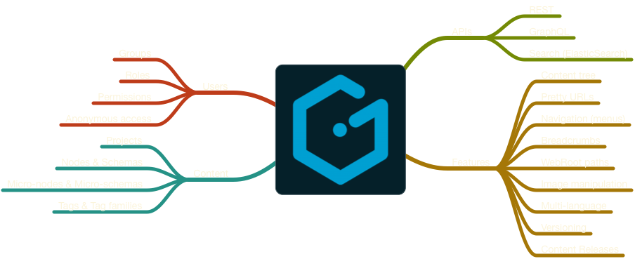

footer: rafael cordones | @rafacm | JAMming with Gentics Mesh, Reat Static and Amazon S3 | We Are Developers Workshops @ APA-IT
slidenumbers: true

# JAMming with Gentics Mesh, React Static and Amazon S3
#### We Are Developers /  Workshops @ APA-IT / Vienna, May 16th, 2018

---

# Agenda

1. Teaser talk (20 min.)
1. Gentics Mesh: Tour de Features (30 min.)
1. Break (10 min.)
1. React Static & React (10 min.)
1. Feature implementation (30 min.) 
1. Amazon S3 (10 min.)
1. Wrap-up (5 min.) 

---

# Teaser talk

---

# Credits

---

# Web Content Projects

1. (Internal) content publication
2. (External) user generated content
3. 6-12 months projects
2. 10x of page types
2. 100x of components
2. 1000x of content items
2. 100000x of users

Implemented on a **monolithic CMS**.

---

# Lessons learned (1/3)

Web **front-end design** 
...
**changes** every 2 years but 
....
the **content remains the same**

---

# Lessons learned (2/3)

Thinking (and implementing!) in components

---

# Lessons learned (3/3)

SEO, SEO, SEO: 

1. PageSpeed
2. Own markup
2. Render markup per request vs pre-rendered markup

---

# The Anatomy of a CMS

1. Content modeling
1. Content creation/editing
1. Querying / search
1. Permissions: who can do what
1. Content rendering (frameworks, libraries, ...)
1. ...

---

# Content rendering (frameworks, libraries, ...)

What if...

1. CMS back-end & front-end were completely separated?
1. Front-end could be developed with any tech or framework?
1. Content could be managed independently of the front-end?
1. Content could be access just via APIs

... the **CMS would just focus on content**

---

# The CMS* is dead!
## * Content **Management System**

---
 
# The CMS* is dead!
## * Content **Management System**
# Long Live the CMS*
## * Content **Micro-Service**

## a.k.a. Headless CMS
## a.k.a. API-driven CMS

---

# Headless / API-first CMSs

1. [contentful](https://www.contentful.com/) (Saas)
1. [prismic](https://prismic.io) (Saas)
1. [GraphCMS](https://graphcms.com/) (Saas)
1. [Contenta CMS](https://www.contentacms.org/) (Drupal)
1. ...
1. [Gentics Mesh](https://getmesh.io)

Different **content APIs**!

---

# Content APIs: O Content, where art thou?

> "I Am A [Dev] of Constant Sorrow" 
-- Soggy Bottom [Devs]

---

# Content APIs: O Content, where art thou?

1. Proliferation of content repository APIs adds overhead for developers to learn about the **semantics** of the API
1. One query API language to rule them all?
1. GraphQL support is a MUST HAVE.

---

# Gentics Mesh

1. (Hierarchical) **content tree**: scalability! 
1. APIs: REST, **GraphQL**, ElasticSearch 
1. **Image manipulation**: via API & via management UI
3. **Multi-lingual** support
4. On-(cloud)-premise: **own your content**! 
5. Users, groups, roles & permissions
6. ...

---

# JAMstack

1. JavaScript
2. APIs
3. Markup

---

# Use-cases for "statically" generated websites

---

# Progressive Static-Site generators: React Static vs GatsbyJs

---

# React Static

--- 

# Amazon S3 

---

# The Project

1. ...
2. prismic.io + (Scala) Play! Framework
1. ...
2. Contentful + (JavaScript) Angular 1.x
1. ...
2. GraphCMS + (JavaScript) GatsbyJS
1. **Gentics Mesh + (JavaScript) React Static**

---

# Any questions?!

---

# Gentics Mesh: Tour de Features

---

# Gentics Mesh: Tour de Features

---

# React Static & React

---

# Amazon S3 for website hosting

--- 