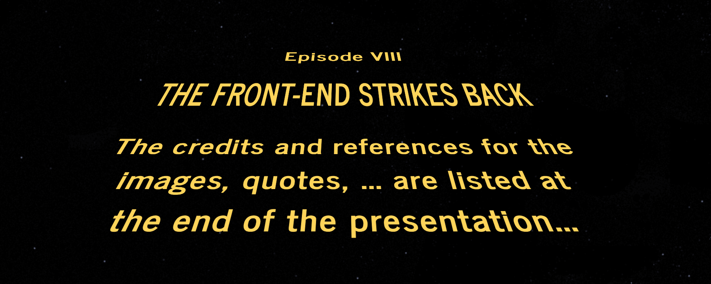
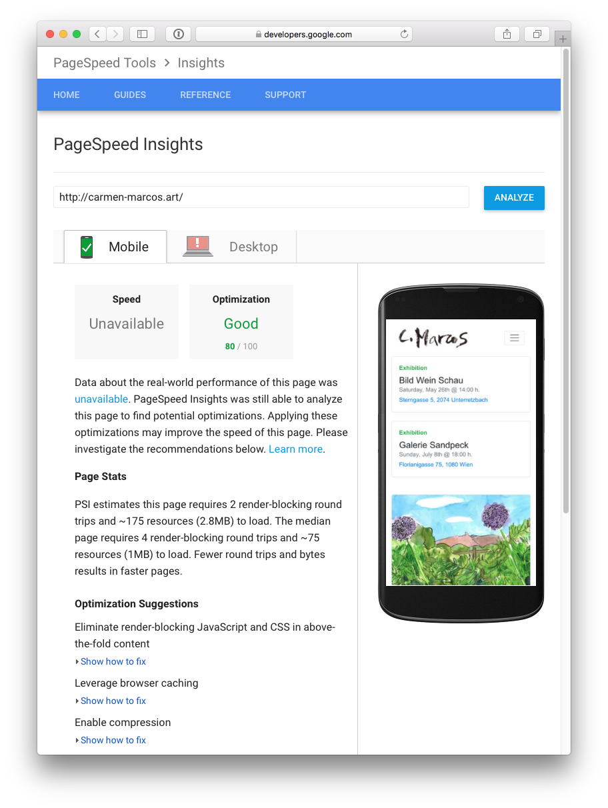
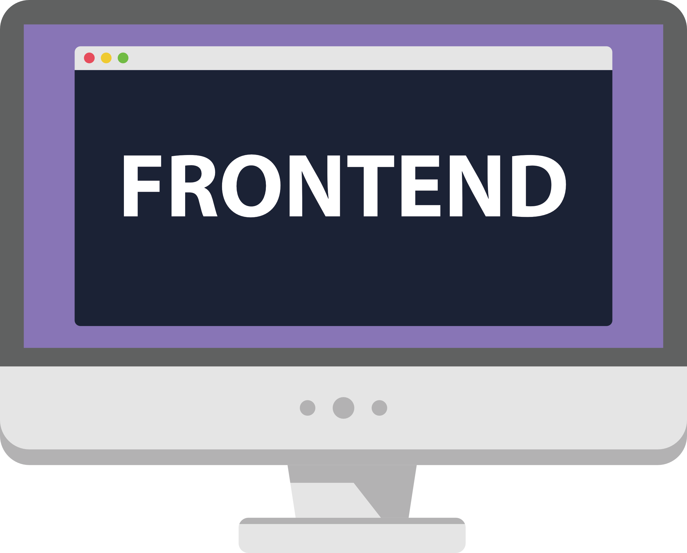
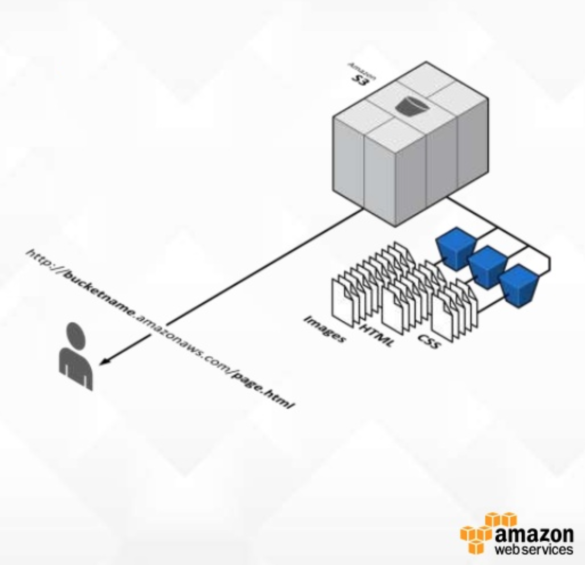

footer: rafael cordones | @rafacm | JAMming with Gentics Mesh, Reat Static and Amazon S3 | We Are Developers Workshop
slidenumbers: true

# JAMming with Gentics Mesh, React Static and Amazon S3
#### We Are Developers Workshop / Vienna, May 17th, 2018

---

# Agenda

1. Intro talk
1. Gentics Mesh: tour of features 
1. Break
1. React Static
1. Features implementation walk-through
1. Amazon S3 
1. Wrap-up

--- 

# Intro talk

---

# What brought you here?

---

# Credits

---

# Web Content Projects

1. (Internal) content publication
2. (External) user generated content
3. 6-12 months projects
2. 10x of page types
2. 100x of components
2. 1,000x of content items
2. 100,000x of users

Implemented on a **coupled CMS**.

---

### The content stays the same 

##Web **front-end design** 
##**changes** every 2 years but 
##the **content remains the same**

---

# Thinking (and implementing!) in **components**
 

---

# SEO, SEO, SEO

1. Page speed: Time to first byte (TTFB)
2. Light-weight markup
2. Pre-rendered markup vs render markup per request
3. Nice & structured URLs
4. Breadcrumbs with metadata
5. ...

---

# The Anatomy of a CMS

1. Content **modeling** 
2. Existing content **migration**
1. Content **creation/editing**
1. Querying / search / API integrations
1. **Permissions**: who can do what (users, groups, ...)
1. **Content rendering (frameworks, libraries, ...)**
1. ...

---

# What if...

1. CMS **back-end** & **front-end** were completely **separated**?
1. **Content editors** use an internal web interface?
1. **Front-end** could be **developed with any tech** or framework?

... the **CMS would just focus on content**

---

# The CMS* is dead!
## * Content **Management System**

---
 
# The CMS* is dead!
## * Content **Management System**
# Long Live the CMS*
## * Content **Micro-Service**

## a.k.a. Headless CMS
## a.k.a. API-driven CMS

---

# The content stays the same

Headless / API-first CMSs

1. [contentful](https://www.contentful.com/) (Saas)
1. [prismic](https://prismic.io) (Saas)
1. [GraphCMS](https://graphcms.com/) (Saas)
1. [Contenta CMS](https://www.contentacms.org/) (Open-Source)
1. ...
1. [Gentics Mesh](https://getmesh.io) (Open-Source)

... all with different **content APIs**!

---

# Content APIs: O Content, where art thou?

> "I Am A [Dev] of Constant Sorrow" 
-- Soggy Bottom [Devs]

---

# Content APIs: O Content, where art thou?

1. Proliferation of content repository APIs adds overhead for developers to learn about the **semantics** of the API
1. One query API language to rule them all?
1. **GraphQL support is a MUST HAVE.**

---

# Headless CMS: Gentics Mesh

1. (Hierarchical) **content tree**: scalability! 
1. APIs: REST, **GraphQL**, ElasticSearch 
1. **Image manipulation**: via API & via management UI
3. **Multi-lingual** support
4. On-(cloud)-premise: **own your content**! 
5. Users, groups, roles & permissions
6. Content **migrations**

---

# React: it's components all the way down!
 

---

# React Static: my gateway drug to React

---

# SEO, SEO, SEO

**JAMstack**

1. **J**avaScript: the language of the web
2. **A**PIs: to access content
3. **M**arkup: pre-rendered HTML markup

**Amazon S3 for content delivery**

1. Managed, scalable and cheap

/ **The browser is the new server!** /

---

# Main takeways (1/2)

As a back-end developer:

1. Do you build your own search engine, business process engine, ...? 
No you don't.
1. Do you build your own content management infrastructure? 
You should not.

---

# Main takeways (2/2)

As a front-end developer

1. Abstract away the management aspect of content
1. Focus on the front-end implementation with freedom of choice

---

# The Project

1. ...
2. prismic.io + (Scala) Play! Framework
1. ...
2. Contentful + (JavaScript) Angular 1.x
1. ...
2. GraphCMS + (JavaScript) GatsbyJS
1. **Gentics Mesh + (JavaScript) React Static**

---

# The Project

https://github.com/rafacm/carmen-marcos-art-portfolio

---

# Any questions?!

---

# Gentics Mesh: Tour de Features

---

# Gentics Mesh: Tour de Features

---

# React Static

---

# React Static: Develop

1. Low conceptual complexity:
   1. getSiteData() -> HOC
   1. getRouteData() -> HOC
3. Source data agnostic
4. Hot-reload
4. Webpack customization possible

---

# React Static: Serve

1. Not only **static**
1. Full-blown React SPA available too
1. Pre-fetches <Link to={}> components 
  
---

# Amazon S3 for content delivery

1. S3 is the static web server
1. S3 is fully managed and scales
1. (Optionally) add CDN capabilities with CloudFront
1. ACHTUNG! Images are still hosted on Gentics Mesh
1. JavaScript in the browser is still available (**J**AM) 
1. JavaScript in the browser has access to Gentics Mesh APIs (J**A**M) 

--- 

# Thanks for your time! 

---

# Credits & Refernces
- Slide 4: [Astronomy Picture of the Day](https://apod.nasa.gov/apod/ap080104.html)
- Slide 5: [Star Wars Opening Crawl generator](https://brorlandi.github.io/StarWarsIntroCreator)
- Slide 9: [PageSpeed Insights](https://developers.google.com/speed/pagespeed/insights/)
- Slide 10: [The Anatomy Lesson of Dr. Nicolaes Tulp](https://en.wikipedia.org/wiki/The_Anatomy_Lesson_of_Dr._Nicolaes_Tulp)
- Slide 12: [Execution of Louis XVI](https://en.wikipedia.org/wiki/Execution_of_Louis_XVI)
- Slide 13: [Execution of Louis XVI](https://en.wikipedia.org/wiki/Execution_of_Louis_XVI)
- Slide 15:  [Man of constant sorrow](https://www.youtube.com/watch?v=meCZ5hWNRFU)

---

# Credits & References
- Slide 16: [GraphQL](https://graphql.org/)
- Slide 20: [Headless CMS](https://headlesscms.org/)
- Slide 17: [Gentics Mesh](https://getmesh.io/)
- Slide 19: [React lifecycle methods](https://twitter.com/dan_abramov/status/981712092611989509)
- Slide 21: [JAMStack](https://jamstack.org)
- Slide 23: [Website](http://carmen-marcos.art/) & [Source](https://github.com/rafacm/carmen-marcos-art-portfolio)
- Slide 24: [Website](http://carmen-marcos.art/) & [Source](https://github.com/rafacm/carmen-marcos-art-portfolio)

---

# Credits & References
- Slide 25: [Spies Like Us](https://en.wikipedia.org/wiki/Spies_Like_Us)
- Slide 27: [Gentics Mesh](https://getmesh.io/)
- Slide 29: [React Static](https://react-static.js.org/)
- Slide 30: [React Static](https://react-static.js.org/)
- Slide 31: [AWS May Seminar Series](https://www.slideshare.net/AmazonWebServices/aws-may-webinar-series-48671997)
